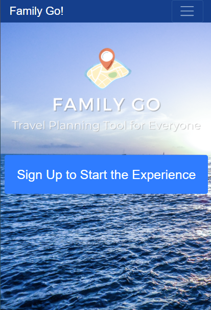
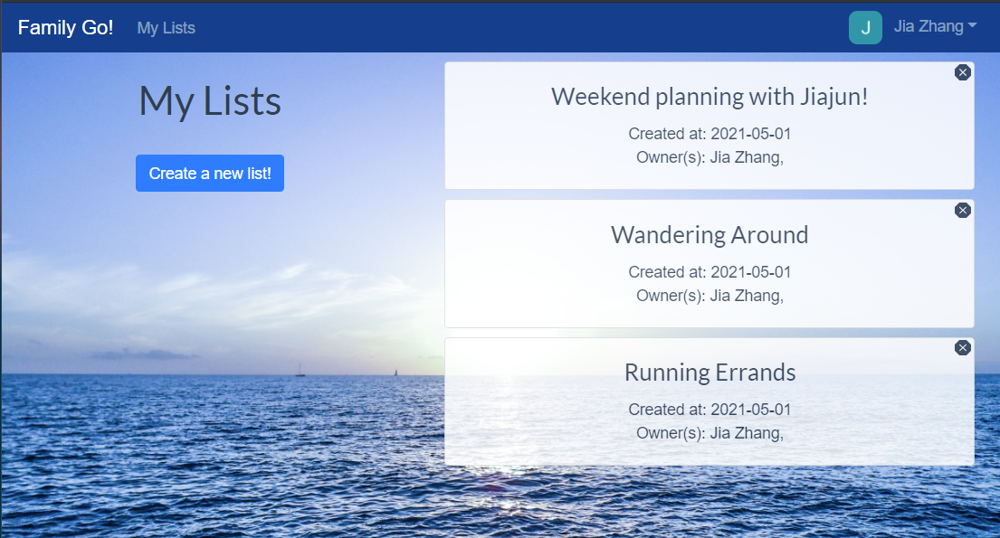
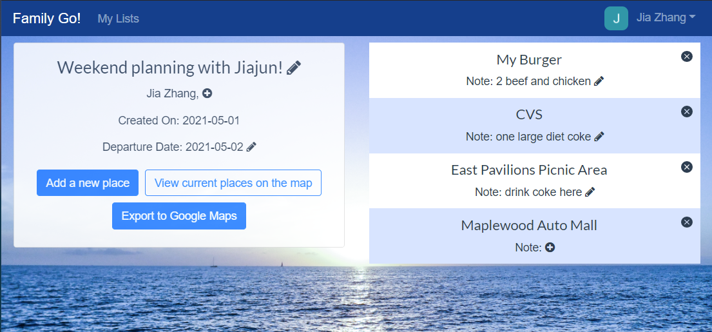
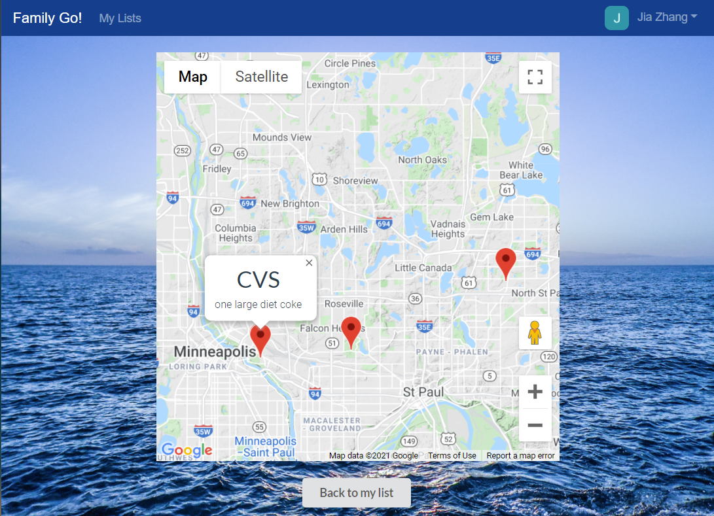
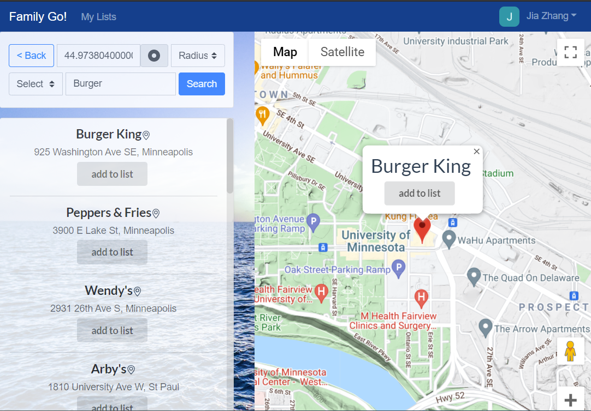

# Family Go by Team Pizza-io

CSCI 5117, Spring 2021

## App Info:

* Team Name: Pizza-io
* App Name: FamilyGo
* App Link: https://family-go-12140.web.app/

## How to run

```
// locally
npm run serve
// deploy
npm run build
firebase deploy --only hosting
```

### Students

* Xihao Li, li002278@umn.edu
* Jia Zhang, zhan7164@umn.edu
* Jiajun Tang, tang0594@umn.edu
* Ruobing Wang, wang8063@umn.edu
* Ruoyan Kong, kong0135@umn.edu

## Key Features

**Describe the most challenging features you implemented
(one sentence per bullet, maximum 4 bullets):**

📅 **Travel Planning**
* Creating lists & adding travel destinations into the lists

🔍 **Flexible Place Search**
* Searching locations using Names, Categories, and Distance

🗺️ **Destinations, Visualized**
* Destinations are visualized via Google Maps API

🔗 **Sharable lists**
* One list could be edited by multiple users simultaneously

## Screenshots

#### Family Go is a website where people could plan their travels together.
#### Here are some screenshots from the completed site:



**:arrow_up:Welcome Page:** This is the welcome page before login.



**:arrow_up:My Lists:** Users could create and delete plans on this page. You will be redirected here after login.



**:arrow_up:List Page:** This is a list of places the user has added into a travel plan. The user could edit list name, visibility, departure date, and notes of all places. The user could also remove places on this page. Finally, the user could export all locations into Google Maps as one route.



**:arrow_up:Map Page:** All places the users added to the list could be seen on the map. Pressing the pin will show the note of the corresponding location.



**:arrow_up:Adding Place:** The user could add places to the plans on this page. There are multiple ways of searching: By name, category, distance, etc. The user needs to provide location to have a better experience.


## External Dependencies

* Google Firebase
	* Authentication and Data storage
* Google Maps API
	* Location services - Search & visualization
* Bootstrap-Vue, Vuesax, Vue-simple-alert
	* Unifying appearance and simplifying code
* Axios
	* Sending rest requests

